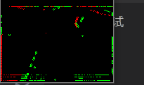

# 16届智能视觉组-简易上位机



为了了解小车运行实际状况,查找元素识别错误原因等,我们用python写了一个图像上位机.

## 发送
参考文件`国赛819稳定12圈（RT1064总钻风巡线）`,最关键的文件是`camera_process.c`

搜索注释`准备发送图像数据`

在小车上,我们用RT1064的DMA-UART传输到串口转无线模块,再传输到电脑.由于串口发送速度有限,很难直接发送整帧灰度或二值图,我们只在每帧到来时发送从near到far大约100行每行的左坐标和右坐标.
```C
SendLine[0] = y;
SendLine[1] = xl;
SendLine[2] = xr;
DMA_start();// DMA串口发送两边沿到电脑
```
50帧下的数据量
$$ 
100 \times 3 \times 8 /1024 /0.02s=100k/s
$$
而逐飞无线模块波特率上限460800的发送速度
$$
460800/8/1024=56k/s
$$
实际上,小车速度并不快,人眼也无法分辨高帧率,没有必要必须每帧都发送,两帧甚至三帧发一帧也是可以接受的.

主要作用是看环岛或三岔误判和出界的原因,可以每百帧发一次圆环标志行和三岔标志行等,在上位机上通过行数区分即可,对误码要求也不高,为了缩减数据量,我们没有使用帧头帧尾.
## 上位机
我们用OpenCV-python写了一个简单的接收程序,开启串口接收,根据接收到第几行的左边右边坐标,用画线函数画两个点,只需接收一定行数就可以看出实时拍摄的边沿了.

参考程序`Draw806_2+.py`

需要安装OpenCV,这个库只用到一些画图函数而已,如果有其他画图的库,也可以替换.

开启串口`ser=serial.Serial("com7",460800,timeout=0.5)`
生成一个黑色图像`img = np.ones((121, 220, 3), np.uint8)`之后画图都在这个图像上画

```python
def draw_cross(img,x,y,color):
    cv.line(img, (x-1, y), (x+1,y), color, thickness, lineType)
    cv.line(img, (x,y-1), (x,y+1), color, thickness, lineType)
```
openCV的画点函数在这种很小的图上效果并不好,见开篇第二个gif,我们用画十字来表示一个点,该函数意义为在图像`img`的坐标`(x,y)`处用颜色`color`画一个十字,效果见第一个gif.


在有数据发送时,`data = ser.readline()`可以读取串口,用`ImgLine = list(data)`转换为列表,然后可以开始画图
```python
if len(ImgLine) == 6 and ImgLine[0]<120: # 行数一定是小于120
    draw_cross(img,ImgLine[1],119-ImgLine[0],red)
    draw_cross(img,ImgLine[2],119-ImgLine[0],green)
    cnt += 1
```

cnt是一个计数值,每画100行视为,这时存储这一帧为jpg,刷新显示,并且用全黑色覆盖画布.
```python
if cnt>100:
    cnt = 0
    cv.imshow('edge', img)
    cv.imwrite("./Img_save/%d.jpg"%img_count, img)
    img = np.ones((121, 220, 3), np.uint8)  # 生成一个空RGB图像
    img_count += 1
```

esc的ASCII值为27,`cv.waitKey(1)==27`意思是当esc按下时该值为真,这时可以结束显示,并读取存储的jpg图像,生成gif图.
```python
if(cv.waitKey(1)==27):
    path = "./Img_save"
    pic_lst = os.listdir(path)
    for name in range(img_count):
        filename = os.path.join(path, str(name)+".jpg")
        gif_images.append(imageio.imread(filename))
    print(np.shape(gif_images))
    imageio.mimsave("814left.gif", gif_images, 'GIF', fps=20)
    break
```

生成后手动清空文件夹`Img_save`里的图像,否则gif可能会拼错.